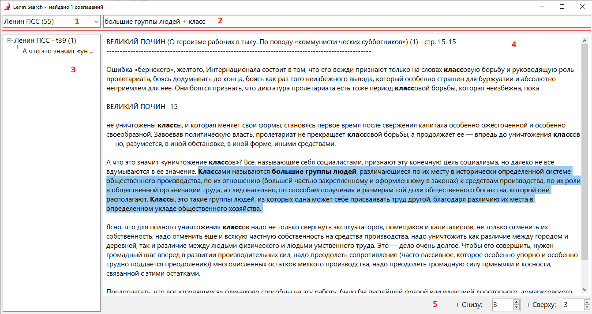

# Lenin Search
Поисковик по корпусу текстов Маркса, Энгельса, Ленина, Сталина, Гегеля

**Внимание!** Приложение доступно в [Google Play](https://play.google.com/store/apps/details?id=dikt_prole.leninsearch) 

Дистрибутив 172 Мб (Windows 7, 8.1, 10 x64) - [LeninSearchSetup v1.0.1](https://github.com/dikt-prole/lenin-search/releases/download/1.0.1/LeninSearchSetup.msi)

[Презентация приложения (Windows) на Len.Ru (самая ранняя версия)](https://youtu.be/eXpYrFGss3g)

[Презентация приложения (Windows) на Len.Ru (последняя версия)](https://youtu.be/vBMvmopJusY)

[Презентация приложения (Android) на Len.Ru](https://www.youtube.com/watch?v=FdG1vtNNu8E)

[Канал проекта на Youtube](https://www.youtube.com/channel/UCrBhNzDc9R-fsqaZZcLpbVQ)

Просим сообщать об обнаруженных ошибках в разделе **Issues** (вверху страницы)

### Инструкция:

1. Выберите корпус текстов
2. Введите поисковый запрос и нажмите **Enter**. Будет произведено сканирование корпуса на предмет точного соответствия. Опционально через "+" можно указать дополнительные слова или фрагменты слов, которые должны встречаться в параграфе. Дополнительные слова разделяются пробелом
3. В этой области отображаются результаты поиска, разделенные по томам. Между ними можно переключаться при помощи мыши или кнопками клавиатуры "вверх", "вниз", "влево", "вправо"
4. В этой области отображается текст выбранного результата поиска + дополнительный контекст + название работы и страница. В тексте выделяются жирным вхождения вашего поискового запроса.
5. Область работы с контекстом. Можно указать сколько дополнительно показывать параграфов снизу и сверху до 1000 параграфов.

